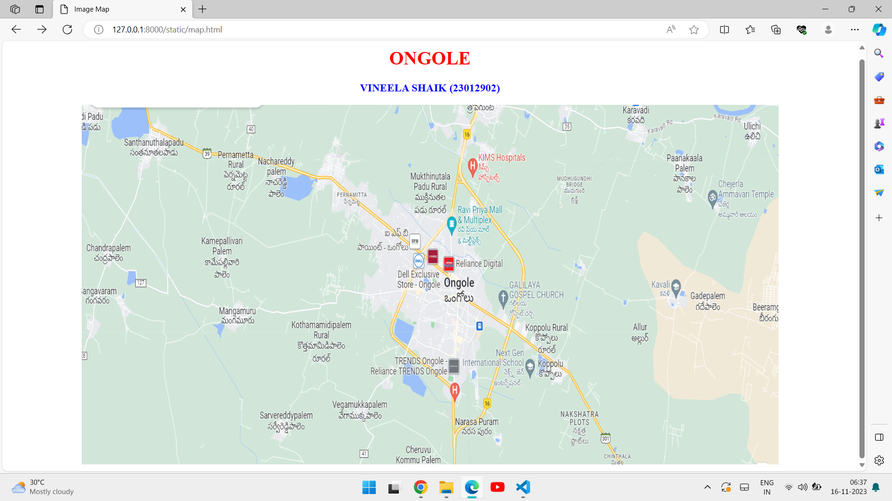
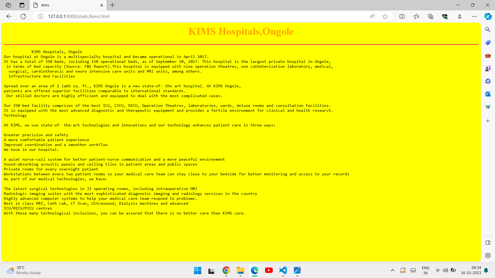
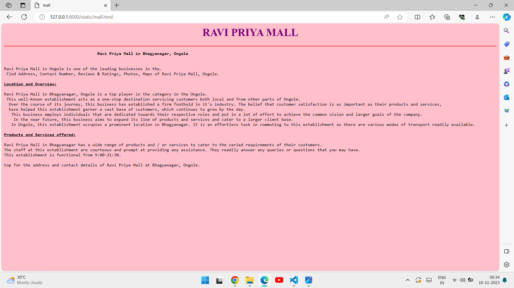
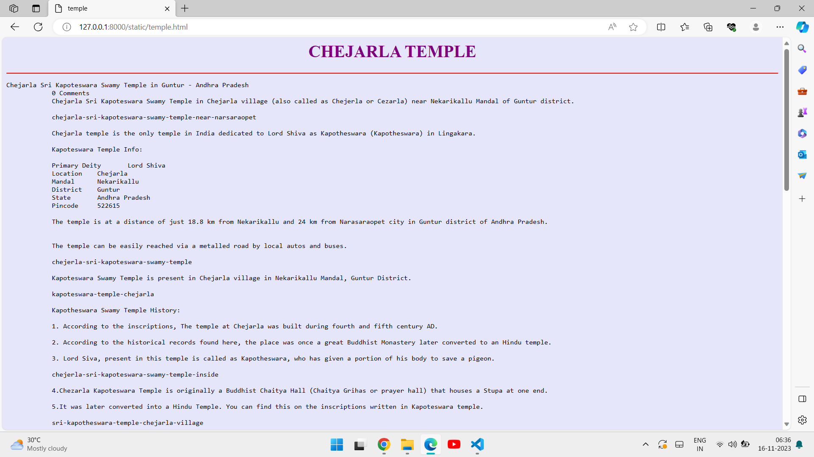
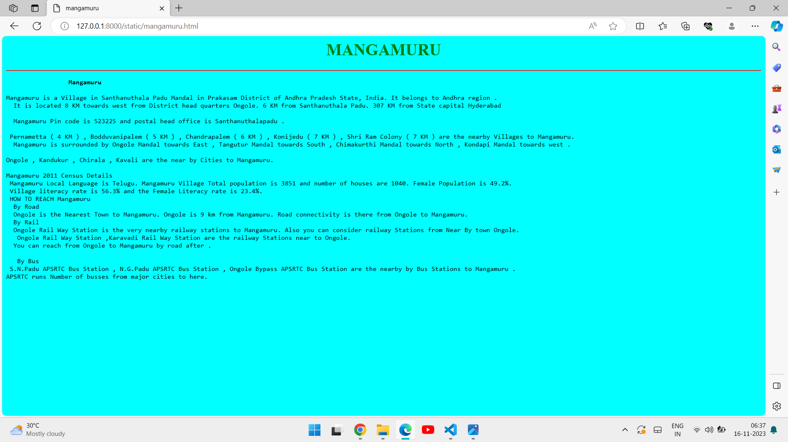

# Ex04 Places Around Me
## Date: 16-11-2023

## AIM
To develop a website to display details about the places around my house.

## DESIGN STEPS

### STEP 1
Create a Django admin interface.

### STEP 2
Download your city map from Google.

### STEP 3
Using ```<map>``` tag name the map.

### STEP 4
Create clickable regions in the image using ```<area>``` tag.

### STEP 5
Write HTML programs for all the regions identified.

### STEP 6
Execute the programs and publish them.

## CODE
```
map.html

<!DOCTYPE html>
<html>
    <head>
        <title>Image Map</title>
    </head>
    <body>
        <h1 align="center"><font color="red"><b>ONGOLE</b></font></h1>
        <h3 align="center"><font color="blue"><b>VINEELA SHAIK (23012902)</b></font></h3>
        <center>
          
    </center>
        
        <map name="mycity">
            <area shape="rect" coords="620,160,725,250" href="mall.html">
            <area shape="rect" coords="230,340,300,385" href="mangamuru.html">
            <area shape="rect" coords="660,80,770,130" href="kims.html">
            <area shape="rect" coords="650,420,780,490" href="next.html">
            <area shape="rect" coords="1050,120,1190,200" href="temple.html">
    </body>
</html>

mall.html

<html>
    <head>
        <title>mall</title>
        <style>
            h1{
           color:purple
        }
        hr{
            border-top:2px solid red
        }
        </style>
    </head>
    <body bgcolor="pink">
        <h1 align="center">RAVI PRIYA MALL</h1>
        <hr>
        <pre>
                                     <strong>  Ravi Priya Mall in Bhagyanagar, Ongole</strong>


Ravi Priya Mall in Ongole is one of the leading businesses in the.
 Find Address, Contact Number, Reviews & Ratings, Photos, Maps of Ravi Priya Mall, Ongole.

<u><b>Location and Overview:</b></u>

Ravi Priya Mall in Bhagyanagar, Ongole is a top player in the category in the Ongole.
 This well-known establishment acts as a one-stop destination servicing customers both local and from other parts of Ongole.
  Over the course of its journey, this business has established a firm foothold in it's industry. The belief that customer satisfaction is as important as their products and services, 
  have helped this establishment garner a vast base of customers, which continues to grow by the day.
   This business employs individuals that are dedicated towards their respective roles and put in a lot of effort to achieve the common vision and larger goals of the company.
    In the near future, this business aims to expand its line of products and services and cater to a larger client base. 
   In Ongole, this establishment occupies a prominent location in Bhagyanagar. It is an effortless task in commuting to this establishment as there are various modes of transport readily available.

<u><b>Products and Services offered:</b></u>

Ravi Priya Mall in Bhagyanagar has a wide range of products and / or services to cater to the varied requirements of their customers. 
The staff at this establishment are courteous and prompt at providing any assistance. They readily answer any queries or questions that you may have. 
This establishment is functional from 9:00-21:30.

top for the address and contact details of Ravi Priya Mall at Bhagyanagar, Ongole.
        </pre>
    </body>
</html>

kims.html

<html>
    <head>
        <title>kims</title>
        <style>
            
         h1{
           color:orange
        }
        hr{
            border-top:2px solid red
        }
            
        </style>
    </head>
    <body bgcolor="yellow">
        <h1 align="center">KIMS Hospitals,Ongole</h1>
        <hr>
        <pre>
            KIMS Hospitals, Ongole
Our hospital at Ongole is a multispecialty hospital and became operational in April 2017. 
It has a total of 350 beds, including 150 operational beds, as of September 30, 2017. This hospital is the largest private hospital in Ongole,
 in terms of bed capacity (Source: F&S Report).This hospital is equipped with nine operation theatres, one catheterization laboratory, medical,
  surgical, cardiothoracic and neuro intensive care units and MRI units, among others.
  Infrastructure And Facilities

Spread over an area of 2 lakh sq. ft., KIMS Ongole is a new state-of- the art hospital. At KIMS Ongole, 
patients are offered superior facilities comparable to international standards.
 Our skilled doctors are highly efficient and equipped to deal with the most complicated cases.

Our 350-bed facility comprises of the best ICU, CICU, NICU, Operation Theatres, laboratories, wards, deluxe rooms and consultation facilities. 
It is equipped with the most advanced diagnostic and therapeutic equipment and provides a fertile environment for clinical and health research.
Technology

At KIMS, we use state-of- the-art technologies and innovations and our technology enhances patient care in three ways:

Greater precision and safety
A more comfortable patient experience
Improved coordination and a smoother workflow
We have in our hospital:

A quiet nurse-call system for better patient-nurse communication and a more peaceful environment
Sound-absorbing acoustic panels and ceiling tiles in patient areas and public spaces
Private rooms for every overnight patient
Workstations between every two patient rooms so your medical care team can stay close to your bedside for better monitoring and access to your records
As part of our medical technologies, we have:

The latest surgical technologies in 33 operating rooms, including intraoperative MRI
Radiologic imaging suites with the most sophisticated diagnostic imaging and radiology services in the country
Highly advanced computer systems to help your medical care team respond to problems.
Best in class MRI, Cath Lab, CT Scan, Ultrasound, Dialysis machines and advanced
ICU/MICU/PICU centres
With these many technological inclusions, you can be assured that there is no better care than KIMS care.
        </pre>
    </body>
</html>

next.html

<html>
    <head>
        <title>next</title>
        <style>
            
         h1{
           color:orangered
        }
        hr{
            border-top:2px solid red
        }
            
        </style>
    </head>
    <body bgcolor="green">
        <h1 align="center">NEXT GEN INTERNATIONAL SCHOOL,Ongole</h1>
        <hr>
        <pre>Today’s School going children will enter their professional lives in the years 2030 – 2040 and will be retiring in the 2070’s. We have no idea of what the world will look like after 50 years, not much even after 15 years; hence we must prepare our children for life in that world.

 

            Set amidst lush green fields in a 12-acre serene campus, Next Gen  International School prepares the child with intellectual, physical, cultural, and artistic skills in a stimulating environment. The mentors foster independence of mind and spirit through kindly guidance and nurturing under the leadership of Directors Dr. K. Sree Vidya & K. Sreekanth Babu, M.S. (USA) and Advisory Directors Dr. K. Muralidhar Reddy & Aravinda and other Board members.

 

               NextGen International school is not only the best school in Ongole, Andhra Pradesh, but it is on par with the reputed & best boarding schools of India with state-of-the-art infrastructure, facilities & activities.

 

             NGIS has been awarded the prestigious British Council ISA (International School Award). It has been ranked No.5 in Andhra Pradesh in Education World School Rankings and as No.3 in Andhra state by Education Today. NGIS has also been awarded as the Most Emergent School, Best Sports Education, Best Infrastructure school, Best School for All Round Development in AP, Top International Boarding School, EduExcellence Award on various platforms of BrainFeed, Digital Learning, Praxis Media, EduSummit, Adf Media, Global Triumph Foundation, Silicon India, Rex Karmaveer, Indian Education Congress Award, Educators Desk (UK), National School Award, etc.

NextGen International School, Ongole is affiliated to CBSE till XII grade vide No. 130504 

Location: The campus is just a stone’s throw away from NH-5 Road & 4km from Ongole Railway Junction, 5km from the Bus stand or the heart of the town. It is 160km (2hrs) from the nearest airport at Vijayawada, 300km (4hrs) from Chennai airport & 340km (5hrs) from Hyderabad airport.

 

Staff: Highly skilled, qualified & experienced teachers are taken from different parts of the country. Also, native language speakers of Spanish and French from Foreign countries are recruited to teach those languages.

 
        </pre>
    </body>
</html>

temple.html

<html>
    <head>
        <title>temple</title>
        <style>
            h1{
           color:purple
        }
        hr{
            border-top:2px solid red
        }
        </style>
    </head>
    <body bgcolor="lavender">
        <h1 align="center">CHEJARLA TEMPLE</h1>
        <hr>
        <pre>Chejarla Sri Kapoteswara Swamy Temple in Guntur - Andhra Pradesh
            0 Comments
            Chejarla Sri Kapoteswara Swamy Temple in Chejarla village (also called as Chejerla or Cezarla) near Nekarikallu Mandal of Guntur district.
            
            chejarla-sri-kapoteswara-swamy-temple-near-narsaraopet
            
            Chejarla temple is the only temple in India dedicated to Lord Shiva as Kapotheswara (Kapotheswara) in Lingakara.
            
            Kapoteswara Temple Info:
            
            Primary Deity	Lord Shiva
            Location	Chejarla
            Mandal	Nekarikallu
            District	Guntur
            State	Andhra Pradesh
            Pincode	522615
            
            The temple is at a distance of just 18.8 km from Nekarikallu and 24 km from Narasaraopet city in Guntur district of Andhra Pradesh.
            
            
            The temple can be easily reached via a metalled road by local autos and buses.
            
            chejerla-sri-kapoteswara-swamy-temple
            
            Kapoteswara Swamy Temple is present in Chejarla village in Nekarikallu Mandal, Guntur District.
            
            kapoteswara-temple-chejarla
            
            Kapotheswara Swamy Temple History:
            
            1. According to the inscriptions, The temple at Chejarla was built during fourth and fifth century AD.
            
            2. According to the historical records found here, the place was once a great Buddhist Monastery later converted to an Hindu temple.
            
            3. Lord Siva, present in this temple is called as Kapotheswara, who has given a portion of his body to save a pigeon.
            
            chejerla-sri-kapoteswara-swamy-temple-inside
            
            4.Chezarla Kapoteswara Temple is originally a Buddhist Chaitya Hall (Chaitya Grihas or prayer hall) that houses a Stupa at one end.
            
            5.It was later converted into a Hindu Temple. You can find this on the inscriptions written in Kapoteswara temple.
            
            sri-kapotheswara-temple-chejarla-village
            
            Main Attractions of Chejarla Temple:
            
            1. The main image of Kapoteswara Linga resembles the "Kalebara" of a great King Sibi Chakravarthy with the head cut off on the top of the Linga.
            
            chejarla-temple-in-narasaraopet-nekarikallu-mandal
            
            2. Two large vertical cavities can be clearly noticed on top of the Shiva Linga. One cavity completely absorbs the abhisheka theertham (holy water) and no one knows, where this water is going.
            
            You can observe the raw flesh smell coming out from this cavity.
            
            lord-subramanya-swamy-temple-at-chejarla
            
            3. It is believed that Kapoteswara Swamy Temple Vimana was originally a Buddhist Chaitya (Prayer Hall) which was modified for the worship of Lord Shiva.
            
            4. Sibi Chakravarthy is a great King in Hindu mythology and the Jataka Tales of Buddhism. A famous story of Sibi Chakravarthy is associated with this temple.
            
            5. Lord Subramanya Swami Temple is present on top of the hills and there are steps to reach the temple. The hill is surrounded by green farm fields and scenic beauty.
            
            sri-subramanya-swamy-idol-near-kapoteswara-temple
            
            Festivals at Chejarla Temple:
            
            Many festivals related to Lord Shiva are celebrated with great fervor at Chejarla Kapoteswara Temple.
            
            Some of the famous festivals celebrated here are: Maha Shivaratri, Devi Navratri and Karthika Masam festivals.
            
            amvar-chejerla-kapoteswara-temple-in-guntur
            
            How to Reach the Temple:
            
            Kapoteswara temple is located at a distance of 11km away from Hyderabad to Addanki highway.
            
            Guntur is at a distance of 78 km and Addanki is at a distance of 63 km from Kapoteswara Temple in the remote village of Chejarla.
            
            By Train:
            
            Narasaraopet Railway Station (NRT) and Piduguralla Railway Station (PGRL) are nearby railway stations. It belongs to Guntur railway division of South Central Railway.
            
            By Bus:
            
            You can easily reach Kapotheswara Temple by bus. From Narasaraopet city, every one hour APSRTC bus is available to reach the temple.
            
            By Air:
            
            The nearest airport is present at Vijayawada near Gannavaram. The airport is at a distance of 145 km from Chejarla.
            
            kapotheswara-alayam-at-chejerla
            
            Best Month to Visit Kapoteswara Temple:
            
            You can visit the temple anytime, but Karthika Masam is very auspicious for Lord Shiva devotees.
            
            Temple Timings:
            
            The temple is open to the devotees from:
            
            Morning: 5:00 am to 12:00 pm
            Evening:  4:30 pm to 06:00 pm
            
            picture-of-kapoteswara-temple-at-chejarla
            
            Food and Accommodation Facility:
            
            Decent food and budget accommodation facility is available at Narasaraopet town. Best hotels with luxury accommodation is available at Guntu city.
            
            chejerla-sri-kapoteswara-swamy-temple-photo
            
            Author Note:
            
            There is another Chejerla village in Nellore district. Sri Kapoteswara Swamy Temple is in Chejarla, Guntur district.
            
            Before you leave, I assume you know about other popular temples in Guntur District. If not, please check out these recent posts:-
            👉 Ponnur Anjaneya Swamy Temple
            👉 Pedakakani Temple
            👉 Mangalagiri Temple
            👉 Jillellamudi Amma Temple
        </pre>
    </body>
</html>

mangamuru.html

<html>
    <head>
        <title>mangamuru</title>
        <style>
            h1{
           color:green
        }
        hr{
            border-top:2px solid red
        }
        </style>
    </head>
    <body bgcolor="aqua">
        <h1 align="center">MANGAMURU</h1>
        <hr>
        <pre>
                <strong> Mangamuru</strong>

Mangamuru is a Village in Santhanuthala Padu Mandal in Prakasam District of Andhra Pradesh State, India. It belongs to Andhra region .
  It is located 8 KM towards west from District head quarters Ongole. 6 KM from Santhanuthala Padu. 307 KM from State capital Hyderabad
            
  Mangamuru Pin code is 523225 and postal head office is Santhanuthalapadu .
            
 Pernametta ( 4 KM ) , Bodduvanipalem ( 5 KM ) , Chandrapalem ( 6 KM ) , Konijedu ( 7 KM ) , Shri Ram Colony ( 7 KM ) are the nearby Villages to Mangamuru.
  Mangamuru is surrounded by Ongole Mandal towards East , Tangutur Mandal towards South , Chimakurthi Mandal towards North , Kondapi Mandal towards west .
            
Ongole , Kandukur , Chirala , Kavali are the near by Cities to Mangamuru.
            
Mangamuru 2011 Census Details
 Mangamuru Local Language is Telugu. Mangamuru Village Total population is 3851 and number of houses are 1040. Female Population is 49.2%.
 Village literacy rate is 56.3% and the Female Literacy rate is 23.4%.
 HOW TO REACH Mangamuru
  By Road
  Ongole is the Nearest Town to Mangamuru. Ongole is 9 km from Mangamuru. Road connectivity is there from Ongole to Mangamuru.
  By Rail
  Ongole Rail Way Station is the very nearby railway stations to Mangamuru. Also you can consider railway Stations from Near By town Ongole.
   Ongole Rail Way Station ,Karavadi Rail Way Station are the railway Stations near to Ongole.
  You can reach from Ongole to Mangamuru by road after .
             
   By Bus
 S.N.Padu APSRTC Bus Station , N.G.Padu APSRTC Bus Station , Ongole Bypass APSRTC Bus Station are the nearby by Bus Stations to Mangamuru .
APSRTC runs Number of busses from major cities to here.
        </pre>
    </body>
</html>

```

## OUTPUT







## RESULT
The program for implementing image maps using HTML is executed successfully.
